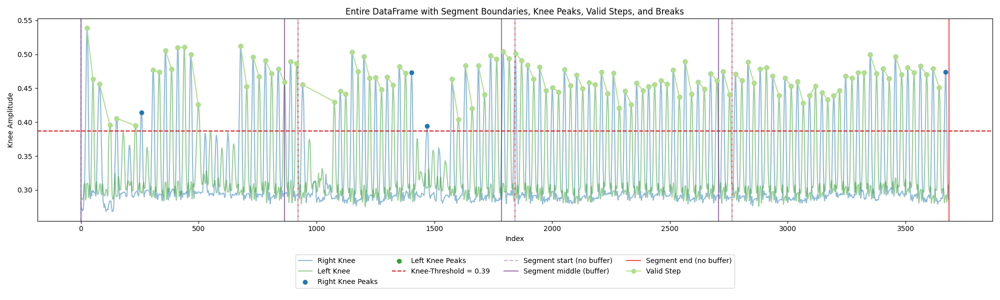

# Statistics in Motion: A python-based heuristic to analyse the 2 Minute Step Test

Jördis Luisa Strack

A Data Science Project for the M. Sc. Social and Economic Data Science at the University Konstanz

# Motivation
The 2-Minute Step Test (2MST) in particular is a functional fitness test used to assess aerobic endurance. It involves measuring the number of full steps (knee lifts) completed within two minutes, where a full step is defined as raising each knee to a point midway between the right kneecap (patella) and right hip bone (iliac crest). This test is commonly used for older adults to evaluate their fitness level, particularly lower-body strength and endurance, which are critical for maintaining functional independence. This project aims to bridge this gap by offering personalized feedback on test takers’ performance during the 2MST using a python based heuristic.

# Task 
To answer the call for an autonomous evaluation program of the 2MST, this project developed code to generate coordinates from video files using Python's MediaPipe and OpenCV, which allow for the analysis of the test taker's performance using a skeletal overlay of 32 landmarks and their x-,y- and z-coordinates. The project then continues, to derive an analysis heuristic to track valid step sequences and obtain additional performance metrics. It concludes in the analysis of the test taker's performance and allows a benchmark comparison of the number of achieved steps as well as in depth feedback over four segments covering the entire duration of the test.

# Heuristic Summary

The program allows to process any mp4 file by transforming it into coordinates, applying Gaussian smoothing, and computing velocity to ensure accuracy. It detects valid steps by calculating knee thresholds and ground intervals, while also analyzing cross-body coordination for proper form. Data is segmented into four 30-second intervals to assess performance consistency, particularly for elderly participants, and the results are used to provide individualized feedback.

# Performance Evaluation

The algorithm was evaluated via precision, recall, F1 macro, and accuracy for each detection task, focusing on both body sides separately. Human-labeled data served as a reference for performance metrics. The algorithm excelled in detecting knee peaks, with precision for left knee detection consistently perfect at 1.0, indicating no false positives. Although recall was slightly lower, ranging from 0.953 to 0.967, the algorithm captured over 95% of true left knee peaks.  Accuracy was high, between 0.9989 and 0.9995, with F1 scores from 0.976 to 0.983. For right knee detection, precision was similarly excellent, with only minor variation. Recall ranged from 0.956 to 0.975, with accuracy comparable to the left knee. Right knee F1 scores were also robust, from 0.976 to 0.987, with few false positives.

Hand movement detection showed more variability, with precision for left hand movements at 1.0, but recall lower, between 0.873 and 0.923. Right hand detection had higher recall, from 0.913 to 0.948, and accuracy consistently above 0.9975. F1 scores ranged from 0.949 to 0.973. Foot ground contact detection was less consistent, with precision for left foot ranging from 0.858 to 0.959, and recall from 0.994 to 1.0. Right foot detection had similar recall but lower precision, leading to more false positives. Ground contact detection could benefit from further fine-tuning, but step detection remains unaffected by these issues due to robust handling of consistent contact intervals. Overall, the algorithm performed well across all tasks.

# Conclusion

In conclusion, the algorithm excels in detecting valid local maxima in hand and knee peaks across different movement types, with particularly strong precision and high recall rates. For knee and hand detection, precision is nearperfect, and recall is consistently strong, though there is some room for improvement in capturing all true events. Performance is strong even if arms and legs are partially covered or the video quality is low as ROC and AUC verify for each dataset. For foot ground contact detection, while precision is slightly lower due to more false positives, the recall remains very high, ensuring that the algorithm captures nearly all true events. To further refine the algorithm, an improvement in consistency and reliability of the humanannotated labels is required, as imperfect values in precision and recall of some datasets can be caused by incorrectly labeled video frames. Overall, the algorithm’s performance is highly effective and well-suited for detecting rare movements with minimal false positives and a high rate of true positive detection. The algorithm at hand allows for automatic and innovative scoring of the 2 Minute Step Test and is among the first programs based entirely on open source programming languages, which makes it easy to use and accessible not only for interdisciplinary research but also test takers at home.

