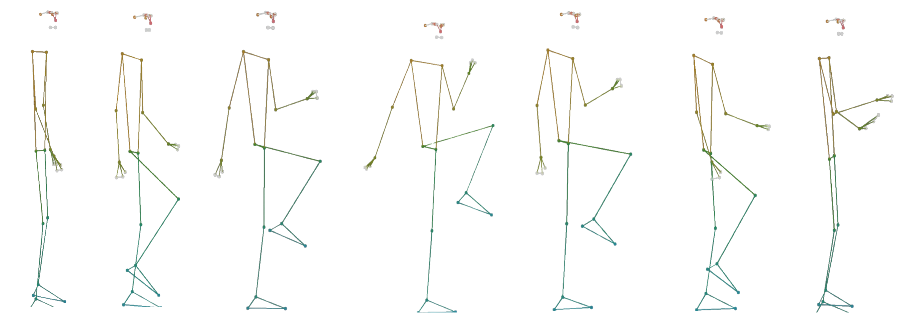

# 2MST_Statistics_in_Motion
A python-based heuristic to analyse the 2 Minute Step Test - A Data Science Project for the M. Sc. Social and Economic Data Science at the University Konstanz

# Motivation
The 2-Minute Step Test (2MST) in particular is a functional fitness test used to assess aerobic endurance. It involves measuring the number of full steps (knee lifts) completed within two minutes, where a full step is defined as raising each knee to a point midway between the right kneecap (patella) and right hip bone (iliac crest). This test is commonly used for older adults to evaluate their fitness level, particularly lower-body strength and endurance, which are critical for maintaining functional independence. This project aims to bridge this gap by offering personalized feedback on test takers’ performance during the 2MST using a python based heuristic.

# Task 

The program should process smartphone video data by transforming it into coordinates, applying Gaussian smoothing, and computing velocity to ensure accuracy. It detects valid steps by calculating knee thresholds and ground intervals, while also analyzing cross-body coordination for proper form. Data is segmented into four 30-second intervals to assess performance consistency, particularly for elderly participants, and the results are used to provide individualized feedback.

